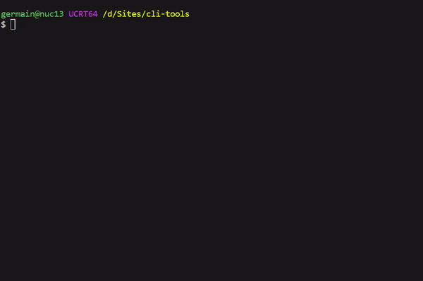

# CLI-TOOLS

# Utilities

## s • Quickly list your .ssh/config connections by group

Type `s` instead of `ssh` to group, select and connect to your SSH hosts from `~/.ssh/config`.

Details for the `s` command in [s/README.md](s/README.md).




# Installation

**Automated install**

```
curl -sSL https://raw.githubusercontent.com/germain-italic/cli-tools/master/installer.sh | bash
```

**Or Manual install**

```
git clone https://github.com/germain-italic/cli-tools.git ~/cli-tools
echo -e "source ~/cli-tools/tools.sh" >> ~/.bashrc
source ~/.bashrc
```

You may need to restart your shell if `source` didn't work.

# Uninstall

```
rm -rf ~/cli-tools
sed -i '/source ~\/cli-tools\/tools.sh/d' ~/.bashrc
```

Then restart your shell.

# Update

```
cd ~/cli-tools && git pull && source ~/.bashrc
```

# Todo

- [ ] Use [Gum](https://github.com/charmbracelet/gum)